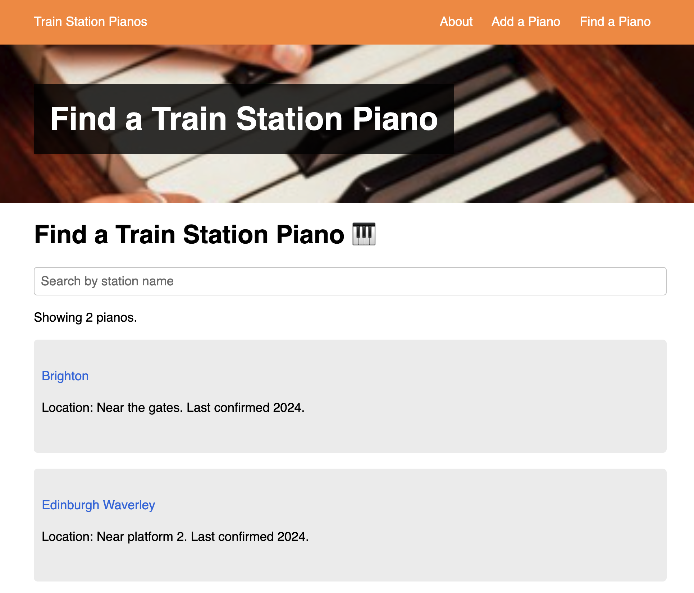

# Train Station Pianos

A directory of train station pianos, hosted at [trainstationpianos.org](https://trainstationpianos.org).

## License

The code in this repository is licensed under an [MIT License](LICENSE).

The written content in this repository (all files ending in `.md`) is licensed into the public domain. The piano data in this repository (`_data/stations.json`) is licensed into the public domain.

## Contributing

Want to add a piano to the site? Fork this repository and add an entry to the `_data/stations.json` file. Then, submit a pull request.

We also welcome contributions to improve the design, function, accessibility and semantics of the site. Please submit a pull request with your changes and I'll review it as soon as possible.